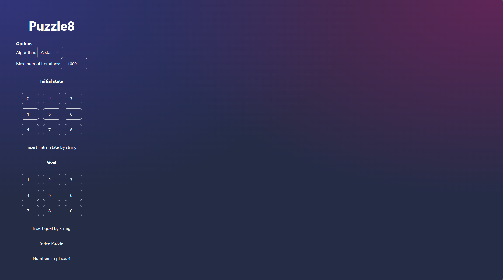
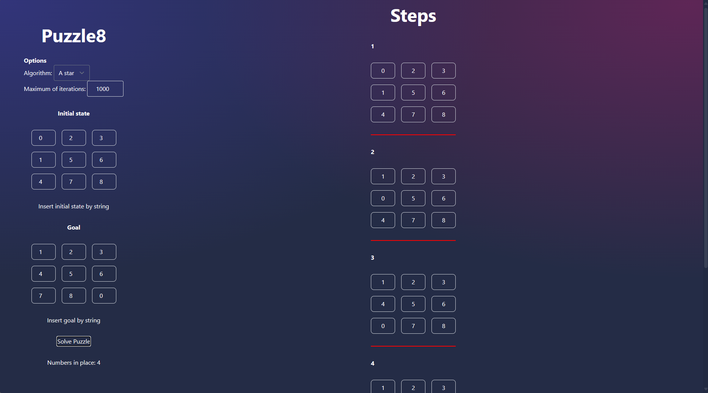

# Puzzle8 solver

## Description
Project include A* star algorithm with GUI for solving varies of Puzzle8

## Install and run

To install and prepare project

```bash
npm install
```

To run locally
```bash
npm run dev
```

## Building

To create a production version of your app:

```bash
npm run build
```

You can preview the production build with `npm run preview`.

## Images of project



